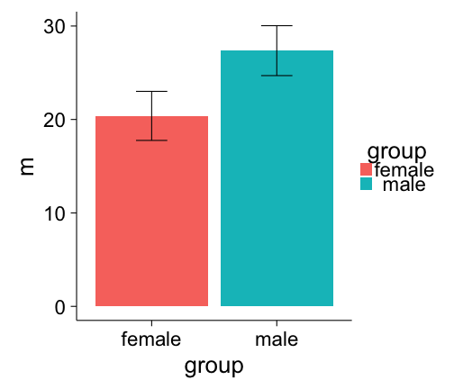
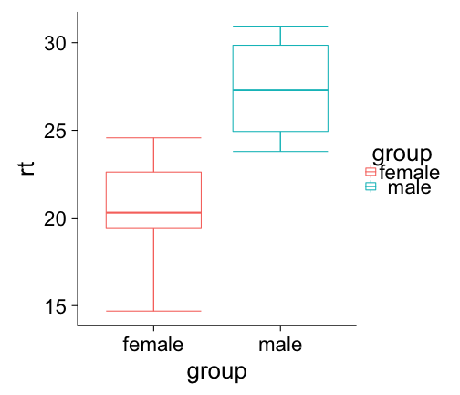
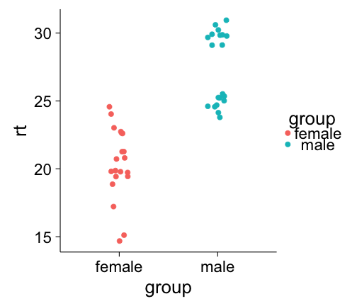
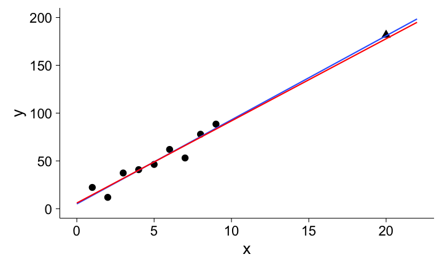
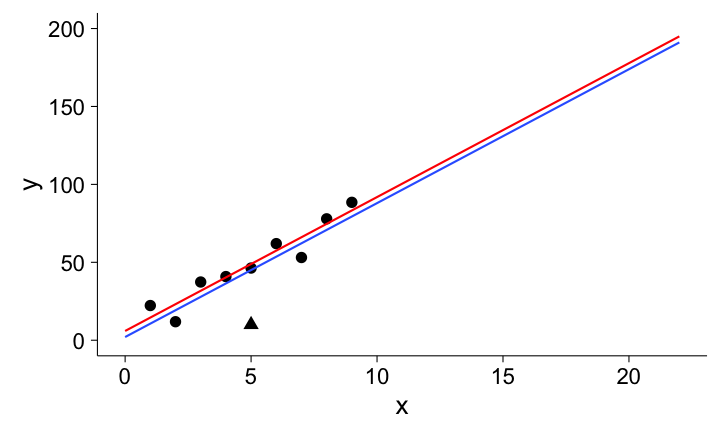
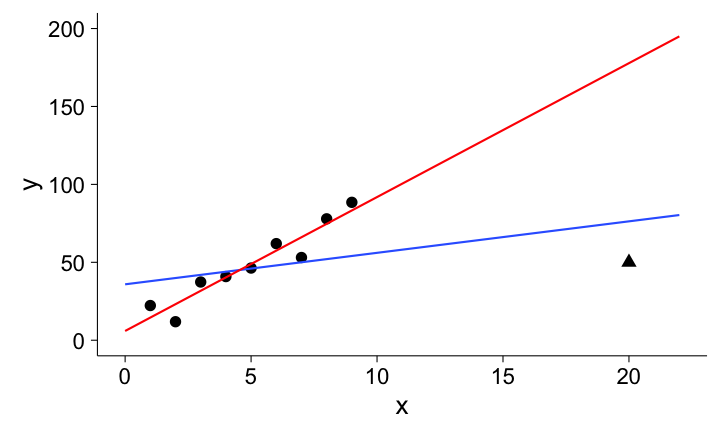
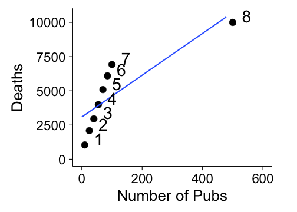
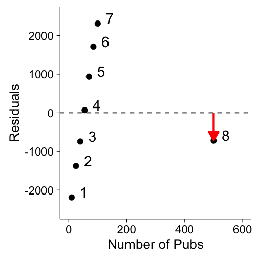
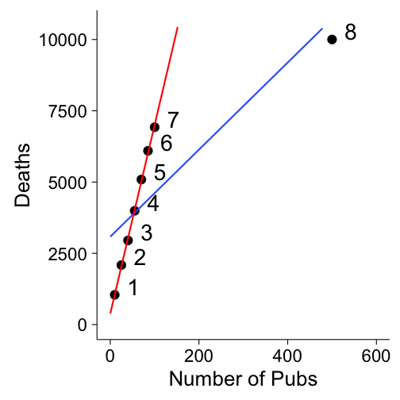
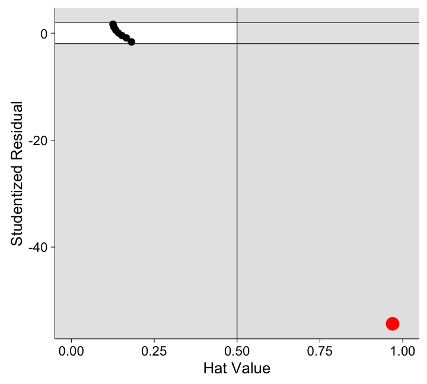

<style>
em {
  font-style: italic
}
strong {
  font-weight: bold;
}

article p, article li, article li.build, section p, section li{
  font-family: 'Open Sans','Helvetica', 'Crimson Text', 'Garamond',  'Palatino', sans-serif;
  text-align: justify;
  font-size:32px;
  line-height: 1.5em;
  color: #444;
}

</style>


<!-- Limit image width and height -->
<style type="text/css">
img {     
  max-height: 560px;     
  max-width: 964px; 
}
</style>
 
<!-- Center image on slide -->
<script type="text/javascript" src="http://ajax.aspnetcdn.com/ajax/jQuery/jquery-1.7.min.js"></script>
<script type="text/javascript">
$(function() {     
  $("p:has(img)").addClass('centered'); 
});
</script>


## Introduction

> * Data -> Model -> Result
> * Often, steps in between are ignored or neglected.
> * Loss of predictive/analytical power.
<br>
> * Know your data before you run a model.
> * strong statistical practices help!
> * Easy to do with R.
<br>
> * http://tillbergmann.com/talks/CSP/ (Slides)
> * http://github.com/tillbe/CSP-talk (RMarkdown)

---

## Two principles:

> * *Visualization* as a tool to *see into* your data.
  <ul class="build incremental">
     <li> Often neglected in favor of measures of central tendency. </li>
     <li> The right visualization can tell you a lot about your data.</li>
  </ul>

> * *Diagnostics* to study how points are participating in your model.
  <ul class="build incremental">
     <li> No individual point should change your model drastically. </li>
     <li> Generally: Leave-one-out diagnostics </li>
     <li> Diagnostic measures: leverage, discrepancy, influence </li>
  </ul>

---

--- &test

## Some data

Let's start with some example data, typical for experimental data. 


*** {name: left}

```r
summary(df) 
```

```
##     group          rt       
##  female:20   Min.   :14.69  
##  male  :20   1st Qu.:20.51  
##              Median :24.09  
##              Mean   :23.87  
##              3rd Qu.:26.42  
##              Max.   :30.95
```

*** {name: right}


```r
head(df)
```

```
##    group       rt
## 1 female 22.74192
## 2 female 18.87060
## 3 female 20.72626
## 4 female 21.26573
## 5 female 20.80854
## 6 female 19.78775
```

--- 

## Summary statistics


```r
library(dplyr)
agg = df %>% 
          group_by(group) %>% 
          summarise(m=mean(rt), sd=sd(rt))
agg
```

```
## Source: local data frame [2 x 3]
## 
##    group        m       sd
##   (fctr)    (dbl)    (dbl)
## 1 female 20.38384 2.625257
## 2   male 27.36450 2.670447
```

> * `Females` have a lower mean reaction time than `males`.
> * The standard deviation is roughly the same.

---

## Simple t-test


```r
with(df,
     t.test(rt ~ group)
    ) 
```

```
## 
## 	Welch Two Sample t-test
## 
## data:  rt by group
## t = -8.3366, df = 37.989, p-value = 4.153e-10
## alternative hypothesis: true difference in means is not equal to 0
## 95 percent confidence interval:
##  -8.675816 -5.285512
## sample estimates:
## mean in group female   mean in group male 
##             20.38384             27.36450
```

---

## Success!?

> * P-value lower than 0.05, significant result, done.

> * We are assuming that the groups are _homogenous_.

> * The summary statistics don't tell us anything about this.

> * Let's visualize the data to see what's going on!

> * Bar plots are commonly used ...

> * But not really helpful!


--- &test

## Standard: Bar plot 


```r
gp = ggplot(agg, aes(y=m, x=group, fill = group)) +
  geom_bar(stat = "identity", position = "dodge") +
  geom_errorbar(aes(ymax = m + sd, ymin = m - sd ), width = 0.25) 
```

*** {name: left}


*** {name: right}

> - Only the summary statistics visible
> - No information about the *distribution*.


--- 

## Drawbacks of barplots

> * It doesn't provide more information than pure numbers. Visualizing a mean standard deviation  does not provide you any more information than simply writing it down.
> * Information is lost: Bar plots don't show any information about sample size or the distribution of data.
> * Bad data-ink ratio: A lot of ink is used to not display additional information (see Tufte).
> * For more, see: [Weissgerber, Milic, Winham, and Garovic (2015)](http://dx.doi.org/10.1371/journal.pbio.1002128).

--- &test

## Alternative I: Boxplot


```r
ggplot(df, aes(x = group, y = rt, col =group)) +
  stat_boxplot(geom ='errorbar') + # adds whiskers to the lines
  geom_boxplot() 
```


*** {name: left}


*** {name: right}

> - Some information about the *distribution*.
> - Such as minimum, maximum, overlap.
> - We still don't know where *individual* points are.


--- &test

## Alternative II: Dot plots


```r
gp = ggplot(df, aes(x = group, y = rt, col = group)) + 
     geom_point(size = 3, 
                position = position_jitter(width = .25)) 
```


*** {name: left}


*** {name: right}

> - `female` group spread out evenly.
> - But: `male` group is bimodal!
> - We could *not* see this before.


---

## Large $N$ (10,000)


--- 

## Visualization is important

> - Visualizing your data in the right way can you tell you a lot more than running a *simple test* or looking at *summary statistics*.
> - Before you run any tests, make sure you explore your data so you know what you are dealing with.
> - When you find "abnormalities" or unexpected behavior in your data, make sure you find out why.

---

## Why is our distribution bimodal?

> - We don't know (actually, because I made it up).
> - There might be an unmeasured latent variable responsible for any potential differences.
> - In experimental settings, there might have been some distraction happening for some participants (cows?)
> - If you can't find a reason, you can always try to get more data.
> - There might be some *outliers* in your data.


---

## Principle II: Influential data points

> * *Leave-one-out* diagnostics: How does my model change if I include/exclude a data point?
> * It shouldn't change by a large degree!
> * Such *diagnostics* are readily available in R.

---

## Outliers and unusual points

### What are outliers? 

> * points that do not fit your model well (*extreme points* )
> * they can also significantly influence your model (coefficients)

### How do we find outliers?

> - visually (previous)
> - different measures (next)

---

## Different types of influential points

Let's consider a simple case with one predictor variable ($x$) and one outcome variable ($y$).

> - **High leverage point**: its $x$-value is either much higher or lower than the mean of the predictor.
> - **High discrepancy point**: unusual $y$ value given its $x$ value.
> - **Influential data point**: combination of leverage and discrepancy.

---


## High Leverage

* $x$-value is either much higher or lower than the mean of the predictor.



---

## High Discrepancy

* unusual $y$ value given its $x$ value.



---

## High Influence

* combination of leverage and discrepancy: influences our model!



--- &test

## Example data (Field et al., 2012):


$x$ (`pubs`): Number of pubs within a borough (district) of London  
$y$ (`deaths`): Number of deaths in that borough over a certain period of time. 

*** {name: left}


```r
pubs
```

```
##   pubs deaths name
## 1   10   1044    1
## 2   25   2087    2
## 3   40   2951    3
## 4   55   3992    4
## 5   70   5088    5
## 6   85   6096    6
## 7  100   6923    7
## 8  500  10000    8
```

*** {name: right}



---

## Leverage

>* Unusual predictor value.
>* In simple linear regression, this is simply the distance from the mean of the predictors.
>* The standardized measure is called *hat value*:
$$\begin{aligned} 
h_i &= \frac{1}{n} + \frac{(X_i - \bar{X})^2}{\sum^n_{j=1}(X_j-\bar{X})^2}
\end{aligned}$$  
>* bound between $1/n$ and 1, with 1 denoting highest leverage

--- &test 

## Calculating Leverage

*** {name: left}


```r
# fitting linear model
mod.pubs = lm(deaths~pubs, data=pubs)

# getting hatvalues and printing them
hs = hatvalues(mod.pubs)
data.frame(pt = pubs$name, 
           hat = hs)
```

```
##   pt       hat
## 1  1 0.1813863
## 2  2 0.1658284
## 3  3 0.1527766
## 4  4 0.1422307
## 5  5 0.1341907
## 6  6 0.1286567
## 7  7 0.1256287
## 8  8 0.9693020
```

*** {name: right}


> * Point 8 has extremely high leverage.

--- 

## Discrepancy

>* unusual $y$ value given its $x$ value.
>* Points that do not fit well into our model.
>* Relevant measure are the *residuals*
>* measures the error of our prediction/fit

--- &test

## Residuals

*** {name: left}



*** {name: right}


```r
residuals(mod.pubs)
```

```
##      residual pt
## 1 -2191.52126  1
## 2 -1377.65473  2
## 3  -742.78821  3
## 4    69.07831  4
## 5   935.94483  5
## 6  1714.81136  6
## 7  2312.67788  7
## 8  -720.54818  8
```


> * Point 8 does not have the highest residual!

--- 

## Studentized Residuals

> * Fit a model without the case of interest, then take residual.
> * Scaled by its hat-value and SD of residuals.
> * A high value means high leverage.
> * $$\begin{align}
E_{i}^{*} = \frac{E_i}{S_{E(-i)}\sqrt{1-h_i}} \end{align}$$
> * Follow a $t$-distribution: useful for confidence intervals

--- &twocolfull

## Studentized Residuals

*** =left


*** =right


```r
rstudent(mod.pubs)
```

```
##       residual pt
## 1  -1.62753088  1
## 2  -0.88072172  2
## 3  -0.44708242  3
## 4   0.04052636  4
## 5   0.56353459  5
## 6   1.11524407  6
## 7   1.68092465  7
## 8 -54.34430523  8
```

*** =fullwidth

> * Point 8 has now the highest residual by far.

---

## Assessing influence

> * Data point 8 has both high discrepancy and high leverage.
> * Likely that it is also influential.
> * Several measures exist for influence:
  <ul class="build incremental">
     <li> DFFITS (based on studentized residuals) </li>
     <li> Cook's <em>d</em> (based on standardized residuals)</li>
     <li> DFBETAS (for each individual predictor) </li>
  </ul>
> * We will look at DFFITS.


---

## DFFITS

> * fit model with and without data point.
> * take difference between the predicted values.
> * do this for all predictors and data points.
> * $$\begin{align}
DFFITS_{i} = E_{i}^{*}\sqrt{\frac{h_i}{1-h_i}}
\end{align}$$
> * $E_{i}$ is the studentized residual  (discrepancy)
> * $h_{i}$ is the hat-value (leverage)
> * influence = discrepancy $\times$ leverage

--- &test

## Calculating DFFITS

*** {name: left}


```r
dffits(mod.pubs)
```


```
##           dffit pt
## 1   -0.76611144  1
## 2   -0.39268159  2
## 3   -0.18985279  3
## 4    0.01650247  4
## 5    0.22185573  5
## 6    0.42854011  6
## 7    0.63715437  7
## 8 -305.37146284  8
```

*** {name: right}


--- &test

## The two models:

*** {name: left}



*** {name: right}


```r
pubs_red = pubs %>% 
              filter(name!=8)
mod.reduced = lm(deaths~pubs, 
                 data=pubs_red)
new_data = data.frame(pubs = 500)
```


```r
predict(mod.pubs, 
        newdata = new_data)
```


```
## [1] 10720.55
```


```r
predict(mod.reduced, 
        newdata = new_data)
```


```
## [1] 33472.14
```

---

## Diagnostic plots

> * We can combine all these measures into one plot.
> * $x$: hat-values (leverage)
> * $y$: studentized residuals (discrepancy)
> * point size: DFFITS (influence)


---

## Influence plots



--- &test

## Influence plots


```r
library(car)
influencePlot(mod.pubs)
```

*** {name: left}


*** {name: right}

```
##     StudRes      Hat    CookD
## 8 -54.34431 0.969302 94.56609
```

> * Plots Cook's *d*
> * relies on standardized residuals (no $t$-distribution)
> * John Fox and Sanford Weisberg (2011)

--- 

## Summary

> * Carefully investigate and explore your data.
> * Use the right visualization for your data.
> * Be careful about influential points.
> * Find the reason behind these points.
> * Use your right model for the data.
> * Not everything is linear!
> * In this example, our extreme case is the *City of London*.

--- 

## More:

* J. J. Faraway. *Linear Models with R*. Boca Raton: Taylor and Francis, 2005.
*  A. Field, J. Miles and Z. Field. *Discovering Statistics Using R*. London and Thousand Oaks, CA: Sage, 2012.
* T. L. Weissgerber, N. M. Milic, S. J. Winham and V. D. Garovic.
"Beyond Bar and Line Graphs: Time for a New Data Presentation
Paradigm". In: _PLOS Biology_ 13.4, p. e1002128. DOI:
[10.1371/journal.pbio.1002128](http://dx.doi.org/10.1371/journal.pbio.1002128).
* http://tillbergmann.com/blog/ 
* John Fox's [website on regression diagnostics](http://socserv.socsci.mcmaster.ca/jfox/Courses/Brazil-2009/index.html)

--- 

## Thank you!

<div align="center" style="font-size: 200%">
<br><br>Thank you for listening!
<br><br><br>
Questions?
</div>

